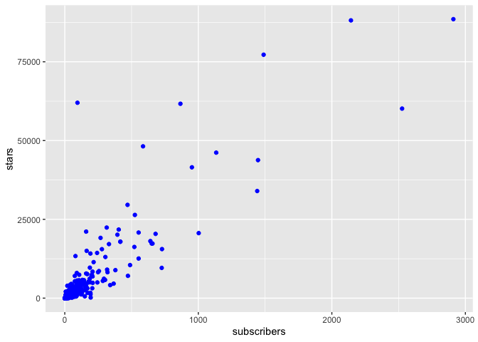
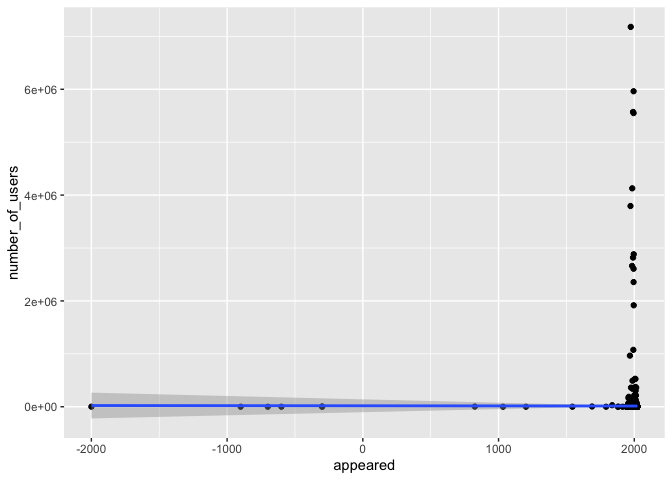
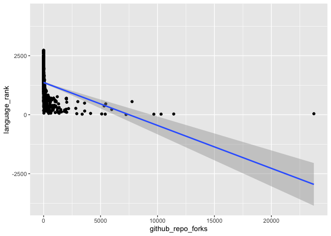
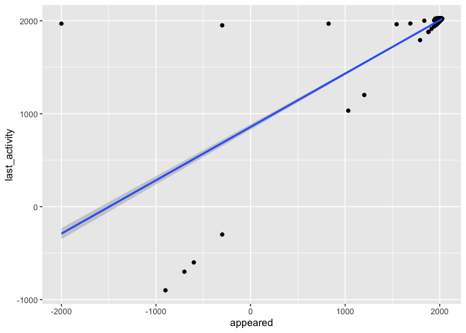
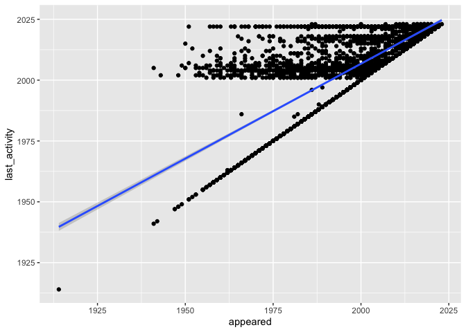
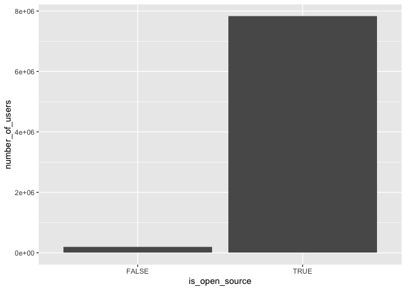
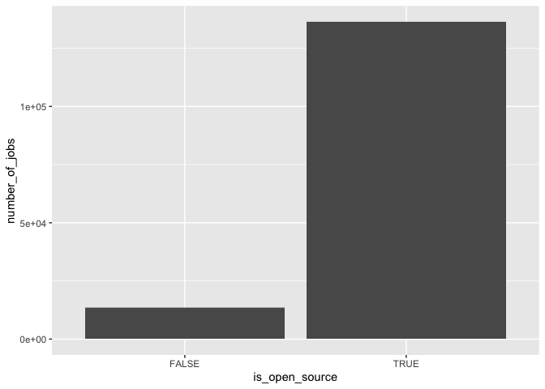
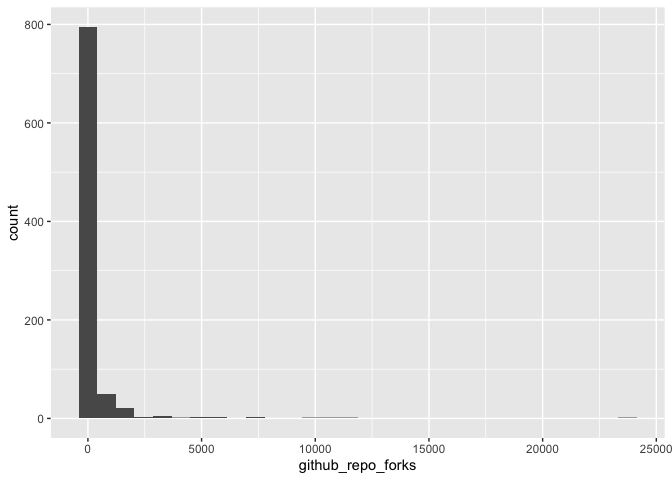

    library(tidyverse)

    ## ── Attaching packages ─────────────────────────────────────── tidyverse 1.3.2 ──
    ## ✔ ggplot2 3.4.1     ✔ purrr   1.0.1
    ## ✔ tibble  3.1.8     ✔ dplyr   1.1.0
    ## ✔ tidyr   1.3.0     ✔ stringr 1.5.0
    ## ✔ readr   2.1.4     ✔ forcats 1.0.0
    ## ── Conflicts ────────────────────────────────────────── tidyverse_conflicts() ──
    ## ✖ dplyr::filter() masks stats::filter()
    ## ✖ dplyr::lag()    masks stats::lag()

    library(kableExtra)

    ## 
    ## Attaching package: 'kableExtra'
    ## 
    ## The following object is masked from 'package:dplyr':
    ## 
    ##     group_rows

    languages <- readr::read_csv('https://raw.githubusercontent.com/rfordatascience/tidytuesday/master/data/2023/2023-03-21/languages.csv')

    ## Rows: 4303 Columns: 49
    ## ── Column specification ────────────────────────────────────────────────────────
    ## Delimiter: ","
    ## chr (21): pldb_id, title, description, type, creators, website, domain_name,...
    ## dbl (24): appeared, domain_name_registered, isbndb, book_count, semantic_sch...
    ## lgl  (4): features_has_comments, features_has_semantic_indentation, features...
    ## 
    ## ℹ Use `spec()` to retrieve the full column specification for this data.
    ## ℹ Specify the column types or set `show_col_types = FALSE` to quiet this message.

    kbl(
      head(languages)
    )

    head(languages)

    ## # A tibble: 6 × 49
    ##   pldb_id    title descr…¹ type  appea…² creat…³ website domai…⁴ domai…⁵ refer…⁶
    ##   <chr>      <chr> <chr>   <chr>   <dbl> <chr>   <chr>   <chr>     <dbl> <chr>  
    ## 1 java       Java  <NA>    pl       1995 James … https:… <NA>         NA <NA>   
    ## 2 javascript Java… <NA>    pl       1995 Brenda… <NA>    <NA>         NA https:…
    ## 3 c          C     <NA>    pl       1972 Dennis… <NA>    <NA>         NA http:/…
    ## 4 python     Pyth… <NA>    pl       1991 Guido … https:… python…    1995 https:…
    ## 5 sql        SQL   <NA>    quer…    1974 Donald… <NA>    <NA>         NA <NA>   
    ## 6 cpp        C++   <NA>    pl       1985 Bjarne… http:/… isocpp…    2012 <NA>   
    ## # … with 39 more variables: isbndb <dbl>, book_count <dbl>,
    ## #   semantic_scholar <dbl>, language_rank <dbl>, github_repo <chr>,
    ## #   github_repo_stars <dbl>, github_repo_forks <dbl>,
    ## #   github_repo_updated <dbl>, github_repo_subscribers <dbl>,
    ## #   github_repo_created <dbl>, github_repo_description <chr>,
    ## #   github_repo_issues <dbl>, github_repo_first_commit <dbl>,
    ## #   github_language <chr>, github_language_tm_scope <chr>, …

    str(languages)

    ## spc_tbl_ [4,303 × 49] (S3: spec_tbl_df/tbl_df/tbl/data.frame)
    ##  $ pldb_id                          : chr [1:4303] "java" "javascript" "c" "python" ...
    ##  $ title                            : chr [1:4303] "Java" "JavaScript" "C" "Python" ...
    ##  $ description                      : chr [1:4303] NA NA NA NA ...
    ##  $ type                             : chr [1:4303] "pl" "pl" "pl" "pl" ...
    ##  $ appeared                         : num [1:4303] 1995 1995 1972 1991 1974 ...
    ##  $ creators                         : chr [1:4303] "James Gosling" "Brendan Eich" "Dennis Ritchie" "Guido van Rossum" ...
    ##  $ website                          : chr [1:4303] "https://oracle.com/java/" NA NA "https://www.python.org/" ...
    ##  $ domain_name                      : chr [1:4303] NA NA NA "python.org" ...
    ##  $ domain_name_registered           : num [1:4303] NA NA NA 1995 NA ...
    ##  $ reference                        : chr [1:4303] NA "https://www.w3schools.com/js/js_reserved.asp" "http://www.c4learn.com/c-programming/c-keywords/" "https://www.programiz.com/python-programming/keyword-list" ...
    ##  $ isbndb                           : num [1:4303] 400 349 78 339 177 128 111 151 269 270 ...
    ##  $ book_count                       : num [1:4303] 401 351 78 342 182 128 116 151 274 276 ...
    ##  $ semantic_scholar                 : num [1:4303] 37 48 19 52 37 6 7 37 26 9 ...
    ##  $ language_rank                    : num [1:4303] 0 1 2 3 4 6 5 7 8 9 ...
    ##  $ github_repo                      : chr [1:4303] NA NA NA NA ...
    ##  $ github_repo_stars                : num [1:4303] NA NA NA NA NA ...
    ##  $ github_repo_forks                : num [1:4303] NA NA NA NA NA ...
    ##  $ github_repo_updated              : num [1:4303] NA NA NA NA NA ...
    ##  $ github_repo_subscribers          : num [1:4303] NA NA NA NA NA ...
    ##  $ github_repo_created              : num [1:4303] NA NA NA NA NA ...
    ##  $ github_repo_description          : chr [1:4303] NA NA NA NA ...
    ##  $ github_repo_issues               : num [1:4303] NA NA NA NA NA NA NA NA 392 NA ...
    ##  $ github_repo_first_commit         : num [1:4303] NA NA NA NA NA ...
    ##  $ github_language                  : chr [1:4303] "Java" "JavaScript" "C" "Python" ...
    ##  $ github_language_tm_scope         : chr [1:4303] "source.java" "source.js" "source.c" "source.python" ...
    ##  $ github_language_type             : chr [1:4303] "programming" "programming" "programming" "programming" ...
    ##  $ github_language_ace_mode         : chr [1:4303] "java" "javascript" "c_cpp" "python" ...
    ##  $ github_language_file_extensions  : chr [1:4303] "java jav" "js _js bones cjs es es6 frag gs jake javascript jsb jscad jsfl jslib jsm jspre jss jsx mjs njs pac sjs ssjs xsjs xsjslib" "c cats h idc" "py cgi fcgi gyp gypi lmi py3 pyde pyi pyp pyt pyw rpy smk spec tac wsgi xpy" ...
    ##  $ github_language_repos            : num [1:4303] 11529980 16046489 2160271 9300725 1222 ...
    ##  $ wikipedia                        : chr [1:4303] "https://en.wikipedia.org/wiki/Java_(programming_language)" "https://en.wikipedia.org/wiki/JavaScript" "https://en.wikipedia.org/wiki/C_(programming_language)" "https://en.wikipedia.org/wiki/Python_(programming_language)" ...
    ##  $ wikipedia_daily_page_views       : num [1:4303] 5242 4264 6268 7204 3084 ...
    ##  $ wikipedia_backlinks_count        : num [1:4303] 11543 8982 10585 6849 4159 ...
    ##  $ wikipedia_summary                : chr [1:4303] "Java is a general-purpose computer programming language that is concurrent, class-based, object-oriented, and s"| __truncated__ "JavaScript (), often abbreviated as JS, is a high-level, dynamic, weakly typed, prototype-based, multi-paradigm"| __truncated__ "C (, as in the letter c) is a general-purpose, imperative computer programming language, supporting structured "| __truncated__ "Python is a widely used high-level programming language for general-purpose programming, created by Guido van R"| __truncated__ ...
    ##  $ wikipedia_page_id                : num [1:4303] 15881 9845 6021 23862 29004 ...
    ##  $ wikipedia_appeared               : num [1:4303] 1995 1995 2011 1991 1986 ...
    ##  $ wikipedia_created                : num [1:4303] 2001 2001 2001 2001 2001 ...
    ##  $ wikipedia_revision_count         : num [1:4303] 7818 6131 7316 6342 4153 ...
    ##  $ wikipedia_related                : chr [1:4303] "javascript pizza ada csharp eiffel mesa modula-3 oberon objective-c ucsd-pascal object-pascal beanshell chapel "| __truncated__ "java lua scheme perl self c python awk hypertalk actionscript coffeescript dart livescript objective-j opa perl"| __truncated__ "cyclone unified-parallel-c split-c cilk b bcpl cpl algol-68 assembly-language pl-i ampl awk c-- csharp objectiv"| __truncated__ "jython micropython stackless-python cython abc algol-68 c dylan haskell icon java lisp modula-3 perl boo cobra "| __truncated__ ...
    ##  $ features_has_comments            : logi [1:4303] TRUE TRUE TRUE TRUE TRUE NA ...
    ##  $ features_has_semantic_indentation: logi [1:4303] FALSE FALSE FALSE TRUE FALSE NA ...
    ##  $ features_has_line_comments       : logi [1:4303] TRUE TRUE TRUE TRUE TRUE NA ...
    ##  $ line_comment_token               : chr [1:4303] "//" "//" "//" "#" ...
    ##  $ last_activity                    : num [1:4303] 2022 2022 2022 2022 2022 ...
    ##  $ number_of_users                  : num [1:4303] 5550123 5962666 3793768 2818037 7179119 ...
    ##  $ number_of_jobs                   : num [1:4303] 85206 63993 59919 46976 219617 ...
    ##  $ origin_community                 : chr [1:4303] "Sun Microsystems" "Netscape" "Bell Labs" "Centrum Wiskunde & Informatica" ...
    ##  $ central_package_repository_count : num [1:4303] NA NA 0 NA 0 0 0 0 NA NA ...
    ##  $ file_type                        : chr [1:4303] "text" "text" "text" "text" ...
    ##  $ is_open_source                   : logi [1:4303] NA NA NA NA NA NA ...
    ##  - attr(*, "spec")=
    ##   .. cols(
    ##   ..   pldb_id = col_character(),
    ##   ..   title = col_character(),
    ##   ..   description = col_character(),
    ##   ..   type = col_character(),
    ##   ..   appeared = col_double(),
    ##   ..   creators = col_character(),
    ##   ..   website = col_character(),
    ##   ..   domain_name = col_character(),
    ##   ..   domain_name_registered = col_double(),
    ##   ..   reference = col_character(),
    ##   ..   isbndb = col_double(),
    ##   ..   book_count = col_double(),
    ##   ..   semantic_scholar = col_double(),
    ##   ..   language_rank = col_double(),
    ##   ..   github_repo = col_character(),
    ##   ..   github_repo_stars = col_double(),
    ##   ..   github_repo_forks = col_double(),
    ##   ..   github_repo_updated = col_double(),
    ##   ..   github_repo_subscribers = col_double(),
    ##   ..   github_repo_created = col_double(),
    ##   ..   github_repo_description = col_character(),
    ##   ..   github_repo_issues = col_double(),
    ##   ..   github_repo_first_commit = col_double(),
    ##   ..   github_language = col_character(),
    ##   ..   github_language_tm_scope = col_character(),
    ##   ..   github_language_type = col_character(),
    ##   ..   github_language_ace_mode = col_character(),
    ##   ..   github_language_file_extensions = col_character(),
    ##   ..   github_language_repos = col_double(),
    ##   ..   wikipedia = col_character(),
    ##   ..   wikipedia_daily_page_views = col_double(),
    ##   ..   wikipedia_backlinks_count = col_double(),
    ##   ..   wikipedia_summary = col_character(),
    ##   ..   wikipedia_page_id = col_double(),
    ##   ..   wikipedia_appeared = col_double(),
    ##   ..   wikipedia_created = col_double(),
    ##   ..   wikipedia_revision_count = col_double(),
    ##   ..   wikipedia_related = col_character(),
    ##   ..   features_has_comments = col_logical(),
    ##   ..   features_has_semantic_indentation = col_logical(),
    ##   ..   features_has_line_comments = col_logical(),
    ##   ..   line_comment_token = col_character(),
    ##   ..   last_activity = col_double(),
    ##   ..   number_of_users = col_double(),
    ##   ..   number_of_jobs = col_double(),
    ##   ..   origin_community = col_character(),
    ##   ..   central_package_repository_count = col_double(),
    ##   ..   file_type = col_character(),
    ##   ..   is_open_source = col_logical()
    ##   .. )
    ##  - attr(*, "problems")=<externalptr>

    ggplot(data = languages, mapping = aes(x = github_repo_subscribers, y = github_repo_stars)) +
      geom_point(color = "blue") +
      labs(x = "subscribers", y = "stars")

    ## Warning: Removed 3418 rows containing missing values (`geom_point()`).

    ggplot(languages, aes(x = appeared, y = number_of_users)) +
      geom_point() +
      geom_smooth(method = "lm")

    ## `geom_smooth()` using formula = 'y ~ x'

    ggplot(languages, aes(x = github_repo_forks, y = language_rank)) +
      geom_point() +
      geom_smooth(method = "lm")

    ## `geom_smooth()` using formula = 'y ~ x'

    ## Warning: Removed 3417 rows containing non-finite values (`stat_smooth()`).

    ## Warning: Removed 3417 rows containing missing values (`geom_point()`).

    ggplot(languages, aes(x = appeared, y = last_activity)) +
      geom_point() +
      geom_smooth(method = "lm")

    ## `geom_smooth()` using formula = 'y ~ x'

    df <-languages %>% 
      filter(appeared > 1900)

    ggplot(df, aes(x = appeared, y = last_activity)) +
      geom_point() +
      geom_smooth(method = "lm")

    ## `geom_smooth()` using formula = 'y ~ x'

    p<- df %>% 
      drop_na(is_open_source) %>%
      ggplot(aes(x=is_open_source, y=number_of_users)) +
      geom_bar(stat="identity")
    p

    p<- df %>% 
      drop_na(is_open_source) %>%
      ggplot(aes(x=is_open_source, y=number_of_jobs)) +
      geom_bar(stat="identity")
    p

git rep vs not githhub repo. ??

    df %>%
      mutate(GH = ifelse(github_repo != NA, 1))

    ggplot(languages, aes(x = github_repo_forks)) +
      geom_histogram()

    ## `stat_bin()` using `bins = 30`. Pick better value with `binwidth`.

    ## Warning: Removed 3417 rows containing non-finite values (`stat_bin()`).

